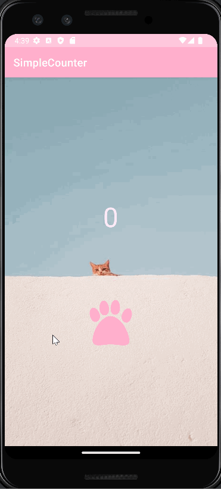

# SimpleCounter

**Simple Counter** is an android app that tracks the number of times a user has tapped on the screen, and allow users to accumulate points that can be exchanged for upgrades. 

## Required Features

The following **required** functionality is completed:

* [X] User can see a number displayed on the screen. The number starts at 0
* [X] User can tap on a button to see the number displayed increase by 1

The following **optional** features are implemented:

* [X] User can exchange 100 taps for an upgrade where each tap will count as 2 taps
* [X] Customize app with pink and blue cat theme 

## Video Walkthrough

Here's a walkthrough of implemented features:

<!-- Replace this with whatever GIF tool you used! -->
GIF created with [LiceCap](http://www.cockos.com/licecap/).  
<!-- Other options include:
[Kap](https://getkap.co/) for macOS
[ScreenToGif](https://www.screentogif.com/) for Windows
[peek](https://github.com/phw/peek) for Linux. -->

## License

    Copyright [2022] [Sophie Tsai]

    Licensed under the Apache License, Version 2.0 (the "License");
    you may not use this file except in compliance with the License.
    You may obtain a copy of the License at

        http://www.apache.org/licenses/LICENSE-2.0

    Unless required by applicable law or agreed to in writing, software
    distributed under the License is distributed on an "AS IS" BASIS,
    WITHOUT WARRANTIES OR CONDITIONS OF ANY KIND, either express or implied.
    See the License for the specific language governing permissions and
    limitations under the License.
